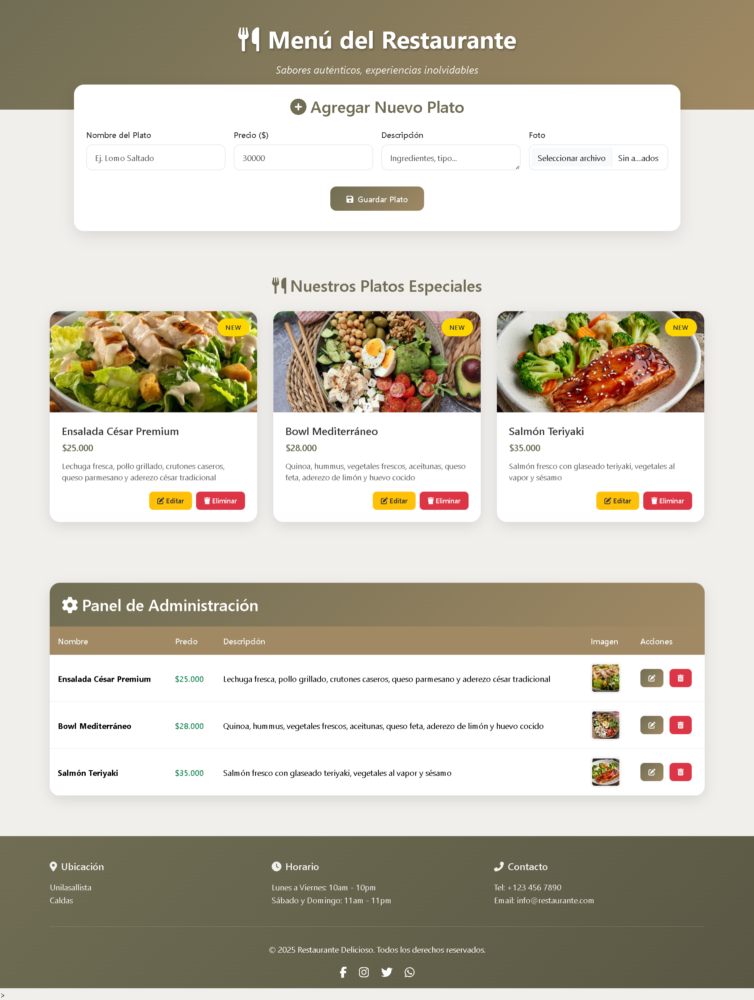
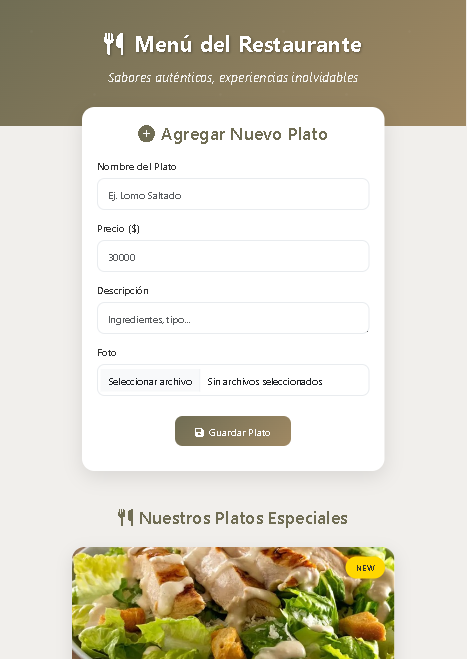

# 🍽️ Sistema de Gestión de Menú de Restaurante

Un sistema web completo para la gestión de menús de restaurantes con interfaz moderna y funcionalidades CRUD completas.


## Objetivo
Este proyecto tiene como objetivo proporcionar una solución completa para la gestión de menús de restaurantes, desde la creación de platos hasta la visualización de los mismos. La aplicación está construida con tecnologías modernas y ofrece una experiencia de usuario intuitiva.
## ✨ Características

- **Gestión Completa de Platos**: Crear, leer, actualizar y eliminar platos del menú
- **Subida de Imágenes**: Sistema seguro para cargar imágenes de platos
- **Interfaz Responsiva**: Diseño adaptable para dispositivos móviles y escritorio
- **Validación de Formularios**: Validación tanto en frontend como backend
- **Notificaciones Elegantes**: Uso de SweetAlert2 para alertas interactivas
- **Diseño Moderno**: UI/UX con gradientes, sombras y animaciones suaves
- **Panel Administrativo**: Tabla completa para gestión de platos
- **Base de Datos Ligera**: SQLite3 para persistencia de datos

## 🛠️ Tecnologías Utilizadas

### Backend
- **Python 3.x** - Lenguaje de programación principal
- **Flask** - Framework web minimalista
- **SQLite3** - Base de datos ligera y eficiente
- **Werkzeug** - Utilidades para aplicaciones WSGI

### Frontend
- **HTML5** - Estructura y semántica
- **CSS3** - Estilos y animaciones modernas
- **JavaScript ES6+** - Lógica de interfaz e interactividad
- **Bootstrap 5** - Framework CSS responsivo
- **Font Awesome** - Iconografía
- **SweetAlert2** - Notificaciones elegantes

## 🚀 Instalación

### Prerequisitos
- Python 3.x instalado en tu sistema
- pip (gestor de paquetes de Python)

## 📱 Capturas de Pantalla

### Vista Desktop


### Vista Mobile



### Pasos de Instalación

1. **Clonar el repositorio**
  ```bash
  git clone https://github.com/GarZa402/MenuRestaurante.git
  cd MenuRestaurante
  ```

2. **Crear un entorno virtual (recomendado)**
```bash

python -m venv venv
```

En Windows
```bash
venv\Scripts\activate
```
En macOS/Linux
```bash
source venv/bin/activate
```
3. **Instalar Dependencias**
```bash
pip install flask werkzeug
```

4. **Ejecutar la aplicación**
```bash
python backend.py
```

## Creditos
- 👤 Juan José García Villegas
- ✉️ jgarcia33@unilasallista.edu.co